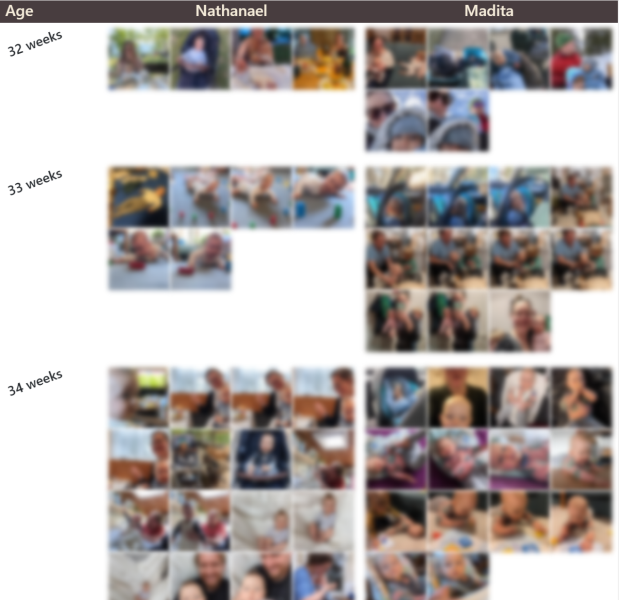

# Same-Age  
Same-Age is a simple Django (Python) application crafted to compare photos of various individuals, pets, plants, or objects, organized by their respective ages. This weekend project was inspired by the desire to see how my children looked at corresponding ages.



## How to run?

### 1. Initial setup

1.1 Set up the local database and apply migrations:
```bash
python manage.py migrate1 
```

1.2 Create an admin user
```bash
python manage.py createsuperuser 
```

1.3 Launch the local server:
```bash
python manage.py runserver
```

Congratulations! The app is now up and running. To access it, simply navigate to http://127.0.0.1:8000 in your browser. Please note that there might not be much to see just yet.


### 2 Adding photos

2.1 Create an input folder, and within this input folder, add two subfolders named after the individuals you want to compare. Place their respective photos inside these subfolders. Ensure that alle the photos contain an EXIF tag.

> input/bonnie/  
> input/clyde/

2.2 Navigate to the application in your browser and click on "Import" (this will open http://127.0.0.1:8000/autoimport). This will initiate the preprocessing and import of photos, which includes:

- Resizing the photos for better manageability
- Copy resized photos to `timeline/static/photos`
- Extracting capture date and potentially other metadata
- (Future feature: performing face recognition)
- Adding the photos to the database

> Note 1: Depending on the number of photos, this process might take some time.

> Note 2: As the application creates a copy of each input image, you can remove the input images after import (this will not happen automatically).


2.3 Return to the home page, and you should see your photos. However, the displayed ages might be incorrect. To fix this, click on Admin and navigate to `Timeline > Persons`.  
You should find an entry for each folder.  
Click on each entry and set the correct birthday, then save.

Now, the accurate ages should be displayed.

> Note: Under `Timeline > Timeline images`, you can edit the metadata of each photo (or even delete its entry), such as adjusting the capture date if necessary.